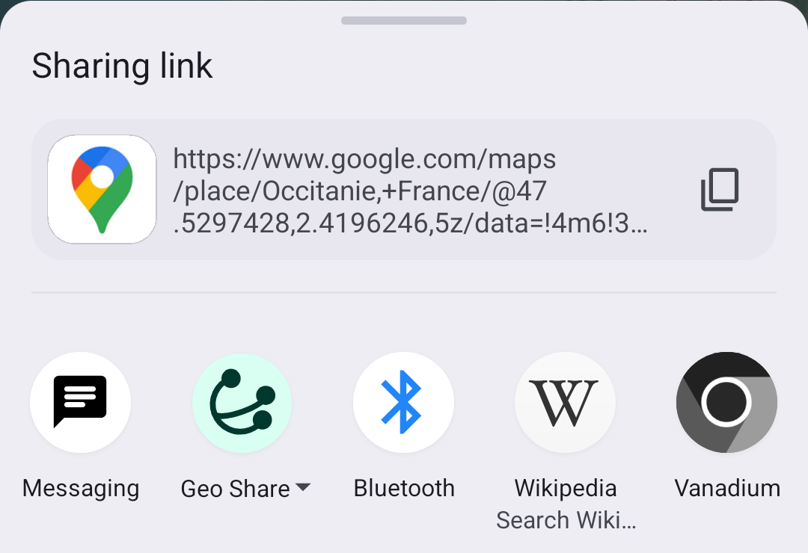

# Geo Share

An Android app to turn Google Maps links into geo: links.

[](https://f-droid.org/packages/page.ooooo.geoshare/)
[](https://apt.izzysoft.de/packages/page.ooooo.geoshare)

## Usage

1. Go to Google Maps or a web browser and share a link with Geo Share:

   

2. Geo Share will turn the link into a geo: link and open it with one of your
   installed apps:

   

Geo Share supports many Google Maps URL formats. Still, if you find a link that
doesn't work, please report an [issue on
GitHub](https://github.com/jakubvalenta/geoshare/issues).

## How it works & anti-features

There are three scenarios how Geo Share turns a Google Maps URL into a geo: URI.
Two of them **communicate with Google's servers**.

1. If the Google Maps URL already contains geographical coordinates, then it's
   parsed and no request to Google's servers is made. Example:
   `https://www.google.com/maps/place/Central+Park/data=!3d44.4490541!4d26.0888398`

2. If the Google Maps URL doesn't contain geographical coordinates, then an HTTP
   GET request is made to the Google Maps URL and the coordinates are parsed
   from the HTML response. Example:
   `https://www.google.com/maps/place/Central+Park/`

   You can imagine it as such a command:

    ```shell
    curl https://www.google.com/maps/place/Central+Park/ | grep -E '/@[0-9.,-]+'
    ```

3. If the Google Maps URL is a short link, then an HTTP HEAD request is made to
   the short link. Then the full Google Maps URL is read from the response
   headers and we go to scenario 1. or 2. Notice that in case of scenario 2.,
   another request will be made, so two requests in total.

   You can imagine it as such a command:

    ```shell
    curl -I https://maps.app.goo.gl/TmbeHMiLEfTBws9EA | grep location:
    ```

## Screenshots

[](./metadata/en-US/images/phoneScreenshots/1.png)
[](./metadata/en-US/images/phoneScreenshots/2.png)

## Installation

### From an app store (recommended)

Get the app on
[](https://f-droid.org/packages/page.ooooo.geoshare/)
or [![Izzy on
Droid](https://img.shields.io/endpoint?url=https://apt.izzysoft.de/fdroid/api/v1/shield/page.ooooo.geoshare&label=IzzyOnDroid&logo=data:image/png;base64,iVBORw0KGgoAAAANSUhEUgAAADAAAAAwCAMAAABg3Am1AAADAFBMVEUA0////wAA0v8A0v8A0////wD//wAFz/QA0/8A0/8A0/8A0/8A0v///wAA0/8A0/8A0/8A0/8A0//8/gEA0/8A0/8B0/4A0/8A0/8A0/+j5QGAwwIA0//C9yEA0/8A0/8A0/8A0/8A0/8A0/+n4SAA0/8A0/8A0/+o6gCw3lKt7QCv5SC+422b3wC19AC36zAA0/+d1yMA0/8A0/+W2gEA0/+w8ACz8gCKzgG7+QC+9CFLfwkA0/8A0////wAA0/8A0/8A0/8A0/+f2xym3iuHxCGq5BoA1P+m2joI0vONyiCz3mLO7oYA0/8M1Piq3Ei78CbB8EPe8LLj9Ly751G77zWQ1AC96UYC0fi37CL//wAA0/8A0////wD//wCp3jcA0/+j3SGj2i/I72Sx4zHE8FLB8zak1kYeycDI6nRl3qEA0/7V7psA0v6WzTa95mGi2RvB5XkPy9zH5YJ3uwGV1yxVihRLiwdxtQ1ZkAf//wD//wD//wD//wD//wCn5gf//wD//wD//wD//wD//wAA0/+h4A3R6p8A0/+X1w565OD6/ARg237n9csz2vPz+gNt37V/vifO8HW68B/L6ZOCwxXY8KRQsWRzhExAtG/E612a1Rd/pTBpmR9qjysduKVhmxF9mTY51aUozK+CsDSA52T//wD//wAA0////wD//wBJ1JRRxFWjzlxDyXRc0pGT1wCG0CWB3VGUzSTh8h6c0TSr5CCJ5FFxvl6s4H3m8xML0/DA5CvK51EX1N+Y2gSt4Dag3ChE3fax2ki68yO57NF10FRZnUPl88eJxhuCxgCz5EOLwEGf1DFutmahzGW98x0W1PGk3R154MHE6bOn69qv3gy92oG90o+Hn07B7rhCmiyMwECv1nO+0pQfwrCo57xF2daXsVhKrEdenQAduaee1Bsjr42z5D9RoCXy+QNovXpy2Z5MtWDO/TiSukaF3UtE1K6j3B4YwLc5wXlzpyIK0u5zy3uJqg4pu5RTpkZmpVKyAP8A0wBHcExHcEyBUSeEAAABAHRSTlP///9F9wjAAxD7FCEGzBjd08QyEL39abMd6///8P/ZWAnipIv/cC6B//7////////L/1Dz/0D///////86/vYnquY3/v///5T//v///17///////////////84S3QNB/8L/////////////7r/////NP////9l/////wPD4yis/x7Ym2lWSP+em////0n////////v///////////////////7//7pdGN3Urr6/+v/6aT////+//H/o2P/1v+7r7jp4PM/3p4g////g///K///481LxO///v////9w////8v/////9/p3J///a+P9v/5KR/+n///+p/xf//8P//wAAe7FyaAAABCZJREFUSMdj+E8iYKBUgwIHnwQ3N7cEHxcH+///VayoAE0Dh41qR7aBnCIQ8MsJKHH9/99czYYMWlA0cIkJGjMgAKfq//9RNYzIgLcBWYOTiCgDMhDn+B9bh6LebiWyH6L5UZQzONoAHWSHoqEpDkkDsyKqelv1//9rG1HUN9YihZK9AKp6BkG+/6xNqA5ajhSsCkrIipmYGGRa//9vQXVQXSySBnkWJOUMfn5Myuz/G3hR1NdEIUUchwiy+bkTsg4dbW/fu6W/e1c3XMMy5JiOZkFxUFZo74mgKTqaKXu0+2HqVwkja3BH9kFu361JwcHTfPJD4mdfe8ULAdVRyGlJAcVFfg+CQOozZ4XrJ85+JgwBsVXIGriQw5Tp4ZScezd8JiWnBupru30qwJZa+ZAjmWlC8fUZM4qB6kPnLNSPLMWqQQ5ZQ5aOzs1HmamBaQHzFs6y+qAmJCTE8f9/QgKSBg4DJPWc6zVDQkIC09JkZSPD38kukpExFpT4z67uYI/QwCOOCCK/izvu5CWl6AcEWMnKWml7LWbKZfH9/99UkknQHhGsynDz+65eWXv3/JmJrq5eXienVlRUfH/z8VvCf45soKQIH1yDEQsszrp6gwq9C73T87xcXadKl5TkFev4A/2tygmSBqYXqAYJmK+ZuoJydDR1vP09DA0NOy2kpdML81+U/heCpH1JU3jig7lJ5nKOT4i/t6ZHkqGzs4lJmIVHfrj+JR4HqLQSD0yDkCNEpGNn5ix9D03/eJdElTZdKV2TpNOhkwt8YUlNUgimgV0dLMBvf1gz1MolPd5FRcVNSkpDQ8owJeBCDyIhrIDnOD5QcuIU+3/2QKSs9laQ+noNLS0zLWdtqyP7mBAFAw88TwsJgMuJYweBGjYngtWbmeuZOW+bvNQToUFOAlFqOBk4Ov3/L7Z60/aN0p1tUhpa5nqWlub7C3p2I9QzyAghlUvczOz/1fhzPT3XSIfpSmmYAdVbmm1gV0dSz8DSilpUQsqCddIWIA3meuZaJqdMJZEzl6gRqgZIWZAxUdoizERXN8yi5MltcZTChzMaRQM3JNUWHS8rL/+yaPGvMmvr5ywoGoxtkDWwQ+Pb89ycBeWfGSJeL/la+RS1eOPnRtbQKgMRjZg+t8x6PkP273nWQAoFOPAgaeAThKXAmXMrK39Kmr5fsuBlBqoXfJGLe3VbmHjG9Mczi9T//3h7vygXtcDlQtJg44iQiIjIBRbGPO7gghPJy0ZIxT2HOLIUgwxQzsgYrUR350HSIMaJLidhgKY+mw+pflBDrX8E7OGBjPCAPc76gQFSTqAIiYrb/8dRP4CyosJ/rmwU5XIxHMilt4QBJwsSkBMClxOQULBlkRRwEONmR2kJcDGjADX2/+xO8r5iqjExqmLyrWpcPFRta1BfAwCtyN3XpuJ4RgAAAABJRU5ErkJggg==)](https://apt.izzysoft.de/packages/page.ooooo.geoshare).

### From an APK file

1. Download the APK from
   [](https://github.com/jakubvalenta/geoshare/releases/latest/download/page.ooooo.geoshare.apk).

2. Verify the APK signature:

   ```shell
   apksigner verify --print-certs page.ooooo.geoshare.apk
   ```

   Expected output:

   ```
   Signer #1 certificate DN: CN=Jakub Valenta, OU=Unknown, O=Unknown, L=Unknown, ST=Unknown, C=DE
   Signer #1 certificate SHA-256 digest: 1b27b17a9df05321a93a47df31ed0d6645ebe55d0e89908157d71c1032d17c10
   Signer #1 certificate SHA-1 digest: f847c6935fa376a568a56ca458896b9236e22b6c
   Signer #1 certificate MD5 digest: 6bcaa6bd5288a6443754b85bf6700374
   ```

3. Install the APK on your phone using adb:

   ```shell
   adb -d install page.ooooo.geoshare.apk
   ```

## Development

Open this repo in Android Studio to run, build and test the app.

### Generating a signed release APK

```shell
make sign keystore_path=/path/to/your/keystore.jks
```

### Installing the release APK on your phone

```shell
make install
```

### Testing various Google Maps links

```shell
adb -s emulator-5554 shell am start -W -a android.intent.action.SEND -t text/plain \
    -e android.intent.extra.TEXT "https://www.google.com/maps/place/Berlin,+Germany/@52.5067296,13.2599309,11z/data=12345?entry=ttu\&g_ep=678910" \
    page.ooooo.geoshare
```

```shell
adb -s emulator-5554 shell am start -W -a android.intent.action.SEND -t text/plain \
    -e android.intent.extra.TEXT 'https://maps.app.goo.gl/TmbeHMiLEfTBws9EA' \
    page.ooooo.geoshare
```

```shell
adb -s emulator-5554 shell am start -W -a android.intent.action.VIEW \
    -d 'https://www.google.com/maps/place/Berlin,+Germany/@52.5067296,13.2599309,11z/data=12345?entry=ttu\&g_ep=678910' \
    page.ooooo.geoshare
```

## Contributing

__Feel free to remix this project__ under the terms of the GNU General Public
License version 3 or later. See [COPYING](./COPYING) and [NOTICE](./NOTICE).
