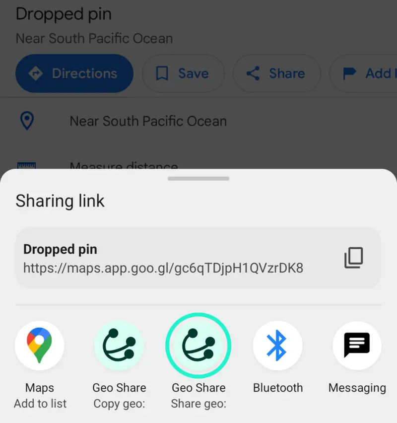
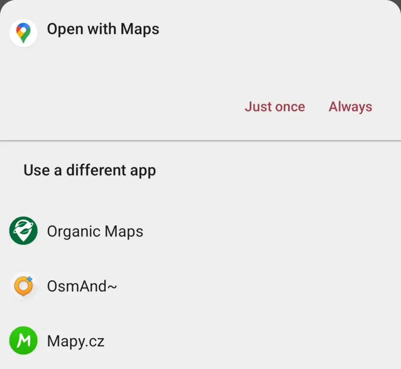
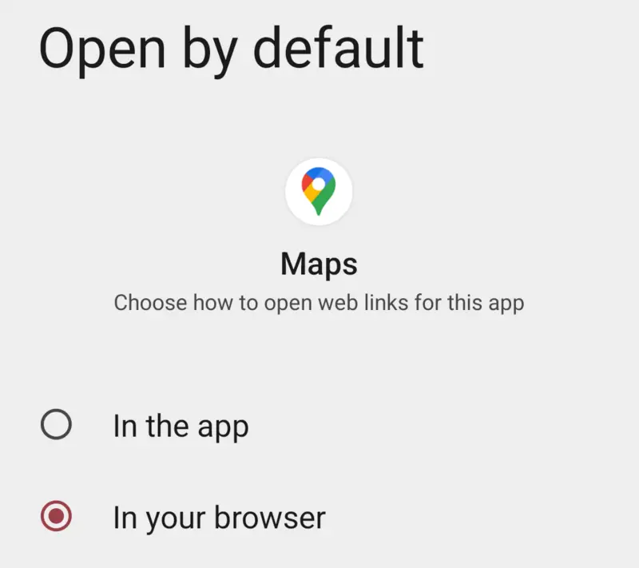
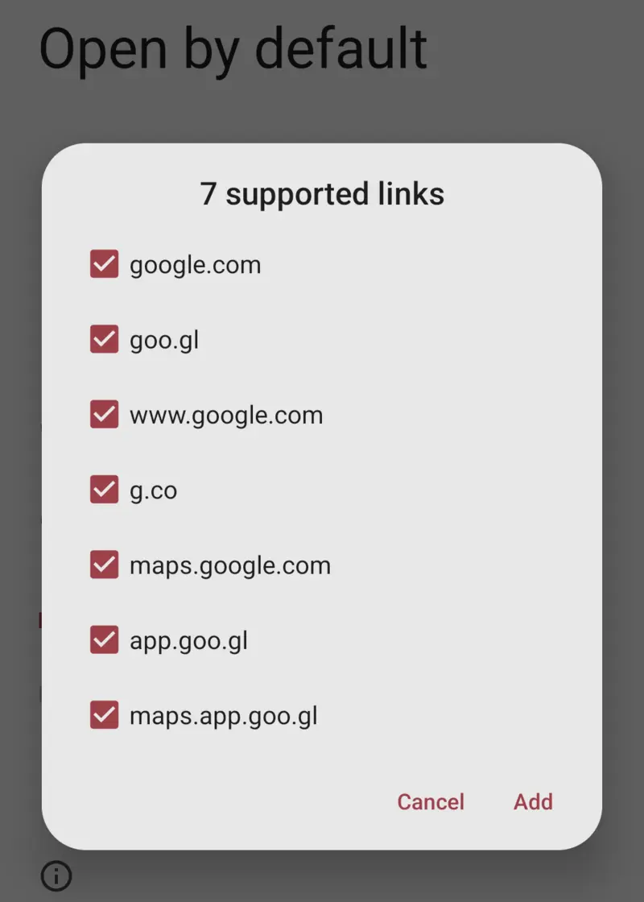
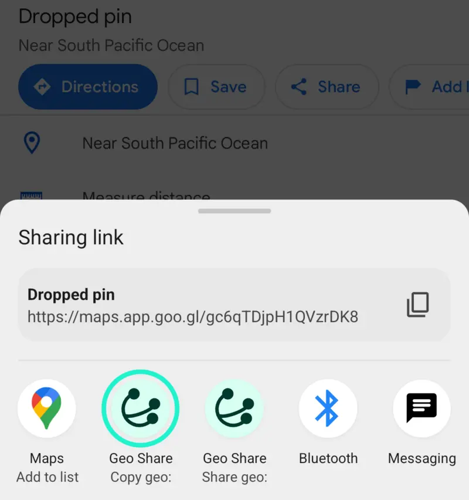
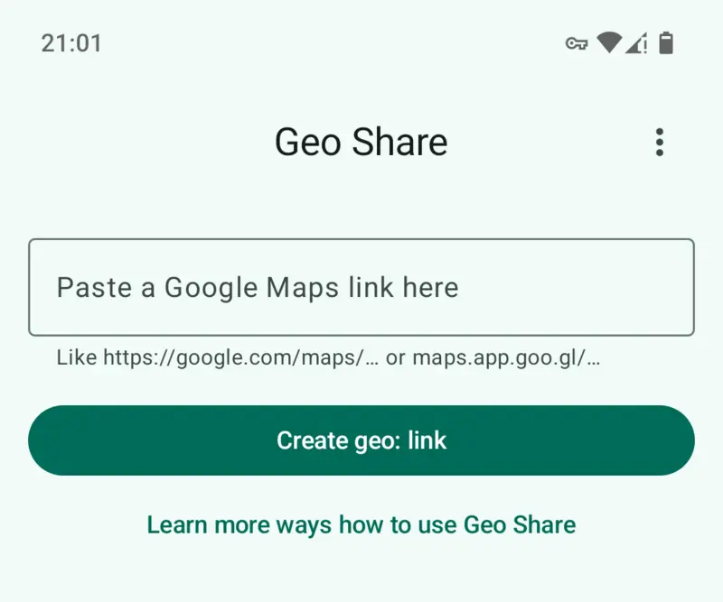
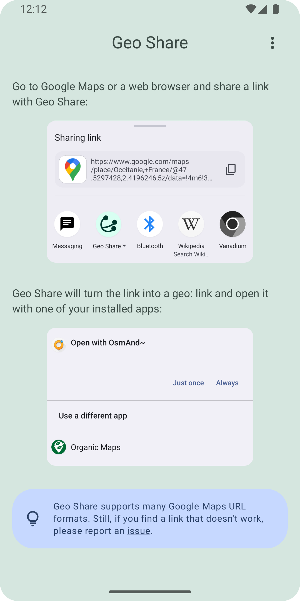
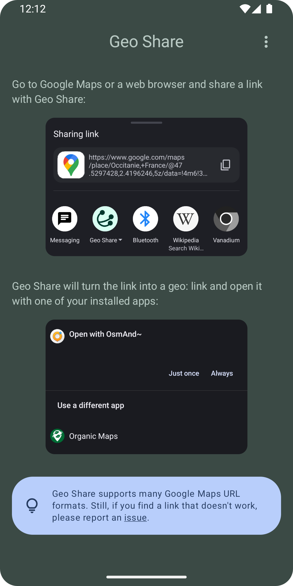
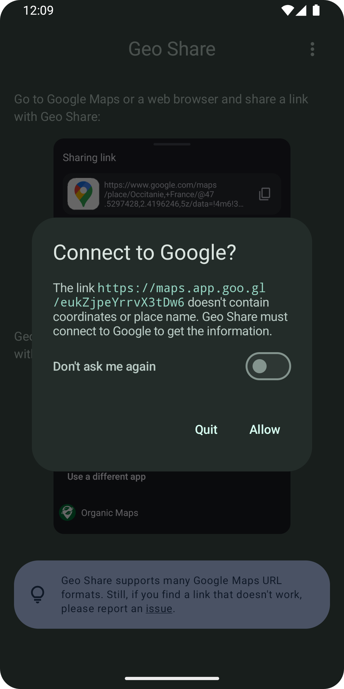

# Geo Share

An Android app to open Google Maps in other map apps and to create geo: links.

[](https://f-droid.org/packages/page.ooooo.geoshare/)
[](https://apt.izzysoft.de/packages/page.ooooo.geoshare)

[](https://hosted.weblate.org/engage/geoshare/)

## When to use Geo Share

If someone sends you a Google Maps link, but you prefer using OpenStreetMap, you
can share the link with Geo Share. The app will open it in an installed map app
of your choice, such as OsmAnd or Organic Maps.

If you like finding places on Google Maps but prefer a different app for
navigation, you can share the location from Google Maps with Geo Share. The app
will open it in your favorite navigation app.

You can also use the app to copy Google Maps links as geo: links to your
clipboard.

## Intro

### How to view Google Maps locations in other map apps

Share a location from Google Maps app or from your web browser.



Choose _Share geo\:_ and Geo Share will let you open the location in any
installed map app.



### Configure Android to open links to Google Maps in alternative maps (optional)

First, go to Settings > Apps > Maps > _Open by default_ and turn off the opening
of links in this app.



Then go to Settings > Apps > Geo Share > _Open by default_, turn on the opening
of links in this app, and tap <i>Add links</i>.



Select at least `maps.google.com` and `maps.app.goo.gl`. If some links are
grayed out, other Google apps are set to open them by default. You can find
these apps and turn off the opening of links for them, like we did for Google
Maps.

### How to create geo: links

Select _Copy geo\:_ when sharing from Google Maps.



Or open Geo Share and paste your Google Maps link there.



## How it works and privacy considerations

Geo Share converts Google Maps links into geo: links that can be opened by other
map apps. To create a geo: link, geographic coordinates are required. Geo Share
extracts them from the Google Maps URL.

However, not all Google Maps URLs include coordinates. In such cases, Geo Share
will **prompt you for permission to connect to Google** and retrieve the
coordinates from either HTTP headers or the HTML document of the link.

More precisely, there are three scenarios how Geo Share converts a Google Maps
URL into a geo: URI:

1. If the Google Maps URL already contains geographic coordinates (for example
   `https://www.google.com/maps/place/Central+Park/data=!3d44.4490541!4d26.0888398`),
   then it's parsed and no request to Google's servers is made.

2. If the Google Maps URL doesn't contain geographic coordinates (for example
   `https://www.google.com/maps/place/Central+Park/`), then Geo Share asks you
   if it can connect to Google.

   If you allow connecting to Google, then Geo Share makes an **HTTP GET
   request** to Google Maps and parses the coordinates from the HTML response.
   You can imagine it as `curl https://www.google.com/maps/place/Central+Park/ |
   grep -E '/@[0-9.,-]+'`.

   If you don't allow connecting to Google, then Geo Share creates a geo: link
   with a place search term (for example `geo:0,0?q=Central%20Park`).

3. If the Google Maps URL is a short link (for example
   `https://maps.app.goo.gl/TmbeHMiLEfTBws9EA`), then Geo Share asks you if it
   can connect to Google.

   If you allow connecting to Google, then Geo Share makes an **HTTP HEAD
   request** to the short link and reads the full link from the response
   headers. You can imagine it as `curl -I
   https://maps.app.goo.gl/TmbeHMiLEfTBws9EA | grep location:`. Then Geo Share
   continues with scenario 1 or 2, depending on whether the full link contains
   coordinates or not. In case of scenario 2, another connection to Google will
   be made, but this time without asking.

   If you don't allow connecting to Google, then Geo Share cancels the creation
   of the geo: link.

To permanently allow or deny connecting to Google instead of always asking (the
default), go to the app's Preferences.

## Compatibility with the GMaps WV app

You don't need Geo Share when using the GMaps WV app, because that app already
produces geo: links. So you can directly share a location from GMaps WV with
another map app.

## Reporting issues

Geo Share supports many Google Maps URL formats. Still, if you find a link that
doesn't work, please report an [issue on
GitHub](https://github.com/jakubvalenta/geoshare/issues).

## Screenshots

[](./metadata/en-US/images/phoneScreenshots/1.png)
[](./metadata/en-US/images/phoneScreenshots/2.png)
[](./metadata/en-US/images/phoneScreenshots/3.png)
[](./metadata/en-US/images/phoneScreenshots/4.png)

## Installation

### From an app store (recommended)

Get the app on
[](https://f-droid.org/packages/page.ooooo.geoshare/)
or [![Izzy on
Droid](https://img.shields.io/endpoint?url=https://apt.izzysoft.de/fdroid/api/v1/shield/page.ooooo.geoshare&label=IzzyOnDroid&logo=data:image/png;base64,iVBORw0KGgoAAAANSUhEUgAAADAAAAAwCAMAAABg3Am1AAADAFBMVEUA0////wAA0v8A0v8A0////wD//wAFz/QA0/8A0/8A0/8A0/8A0v///wAA0/8A0/8A0/8A0/8A0//8/gEA0/8A0/8B0/4A0/8A0/8A0/+j5QGAwwIA0//C9yEA0/8A0/8A0/8A0/8A0/8A0/+n4SAA0/8A0/8A0/+o6gCw3lKt7QCv5SC+422b3wC19AC36zAA0/+d1yMA0/8A0/+W2gEA0/+w8ACz8gCKzgG7+QC+9CFLfwkA0/8A0////wAA0/8A0/8A0/8A0/+f2xym3iuHxCGq5BoA1P+m2joI0vONyiCz3mLO7oYA0/8M1Piq3Ei78CbB8EPe8LLj9Ly751G77zWQ1AC96UYC0fi37CL//wAA0/8A0////wD//wCp3jcA0/+j3SGj2i/I72Sx4zHE8FLB8zak1kYeycDI6nRl3qEA0/7V7psA0v6WzTa95mGi2RvB5XkPy9zH5YJ3uwGV1yxVihRLiwdxtQ1ZkAf//wD//wD//wD//wD//wCn5gf//wD//wD//wD//wD//wAA0/+h4A3R6p8A0/+X1w565OD6/ARg237n9csz2vPz+gNt37V/vifO8HW68B/L6ZOCwxXY8KRQsWRzhExAtG/E612a1Rd/pTBpmR9qjysduKVhmxF9mTY51aUozK+CsDSA52T//wD//wAA0////wD//wBJ1JRRxFWjzlxDyXRc0pGT1wCG0CWB3VGUzSTh8h6c0TSr5CCJ5FFxvl6s4H3m8xML0/DA5CvK51EX1N+Y2gSt4Dag3ChE3fax2ki68yO57NF10FRZnUPl88eJxhuCxgCz5EOLwEGf1DFutmahzGW98x0W1PGk3R154MHE6bOn69qv3gy92oG90o+Hn07B7rhCmiyMwECv1nO+0pQfwrCo57xF2daXsVhKrEdenQAduaee1Bsjr42z5D9RoCXy+QNovXpy2Z5MtWDO/TiSukaF3UtE1K6j3B4YwLc5wXlzpyIK0u5zy3uJqg4pu5RTpkZmpVKyAP8A0wBHcExHcEyBUSeEAAABAHRSTlP///9F9wjAAxD7FCEGzBjd08QyEL39abMd6///8P/ZWAnipIv/cC6B//7////////L/1Dz/0D///////86/vYnquY3/v///5T//v///17///////////////84S3QNB/8L/////////////7r/////NP////9l/////wPD4yis/x7Ym2lWSP+em////0n////////v///////////////////7//7pdGN3Urr6/+v/6aT////+//H/o2P/1v+7r7jp4PM/3p4g////g///K///481LxO///v////9w////8v/////9/p3J///a+P9v/5KR/+n///+p/xf//8P//wAAe7FyaAAABCZJREFUSMdj+E8iYKBUgwIHnwQ3N7cEHxcH+///VayoAE0Dh41qR7aBnCIQ8MsJKHH9/99czYYMWlA0cIkJGjMgAKfq//9RNYzIgLcBWYOTiCgDMhDn+B9bh6LebiWyH6L5UZQzONoAHWSHoqEpDkkDsyKqelv1//9rG1HUN9YihZK9AKp6BkG+/6xNqA5ajhSsCkrIipmYGGRa//9vQXVQXSySBnkWJOUMfn5Myuz/G3hR1NdEIUUchwiy+bkTsg4dbW/fu6W/e1c3XMMy5JiOZkFxUFZo74mgKTqaKXu0+2HqVwkja3BH9kFu361JwcHTfPJD4mdfe8ULAdVRyGlJAcVFfg+CQOozZ4XrJ85+JgwBsVXIGriQw5Tp4ZScezd8JiWnBupru30qwJZa+ZAjmWlC8fUZM4qB6kPnLNSPLMWqQQ5ZQ5aOzs1HmamBaQHzFs6y+qAmJCTE8f9/QgKSBg4DJPWc6zVDQkIC09JkZSPD38kukpExFpT4z67uYI/QwCOOCCK/izvu5CWl6AcEWMnKWml7LWbKZfH9/99UkknQHhGsynDz+65eWXv3/JmJrq5eXienVlRUfH/z8VvCf45soKQIH1yDEQsszrp6gwq9C73T87xcXadKl5TkFev4A/2tygmSBqYXqAYJmK+ZuoJydDR1vP09DA0NOy2kpdML81+U/heCpH1JU3jig7lJ5nKOT4i/t6ZHkqGzs4lJmIVHfrj+JR4HqLQSD0yDkCNEpGNn5ix9D03/eJdElTZdKV2TpNOhkwt8YUlNUgimgV0dLMBvf1gz1MolPd5FRcVNSkpDQ8owJeBCDyIhrIDnOD5QcuIU+3/2QKSs9laQ+noNLS0zLWdtqyP7mBAFAw88TwsJgMuJYweBGjYngtWbmeuZOW+bvNQToUFOAlFqOBk4Ov3/L7Z60/aN0p1tUhpa5nqWlub7C3p2I9QzyAghlUvczOz/1fhzPT3XSIfpSmmYAdVbmm1gV0dSz8DSilpUQsqCddIWIA3meuZaJqdMJZEzl6gRqgZIWZAxUdoizERXN8yi5MltcZTChzMaRQM3JNUWHS8rL/+yaPGvMmvr5ywoGoxtkDWwQ+Pb89ycBeWfGSJeL/la+RS1eOPnRtbQKgMRjZg+t8x6PkP273nWQAoFOPAgaeAThKXAmXMrK39Kmr5fsuBlBqoXfJGLe3VbmHjG9Mczi9T//3h7vygXtcDlQtJg44iQiIjIBRbGPO7gghPJy0ZIxT2HOLIUgwxQzsgYrUR350HSIMaJLidhgKY+mw+pflBDrX8E7OGBjPCAPc76gQFSTqAIiYrb/8dRP4CyosJ/rmwU5XIxHMilt4QBJwsSkBMClxOQULBlkRRwEONmR2kJcDGjADX2/+xO8r5iqjExqmLyrWpcPFRta1BfAwCtyN3XpuJ4RgAAAABJRU5ErkJggg==)](https://apt.izzysoft.de/packages/page.ooooo.geoshare).

### From an APK file

1. Download the APK from
   [](https://github.com/jakubvalenta/geoshare/releases/latest/download/page.ooooo.geoshare.apk).

2. Verify the APK signature:

   ```shell
   apksigner verify --print-certs page.ooooo.geoshare.apk
   ```

   Expected output:

   ```
   Signer #1 certificate DN: CN=Jakub Valenta, OU=Unknown, O=Unknown, L=Unknown, ST=Unknown, C=DE
   Signer #1 certificate SHA-256 digest: 1b27b17a9df05321a93a47df31ed0d6645ebe55d0e89908157d71c1032d17c10
   Signer #1 certificate SHA-1 digest: f847c6935fa376a568a56ca458896b9236e22b6c
   Signer #1 certificate MD5 digest: 6bcaa6bd5288a6443754b85bf6700374
   ```

3. Install the APK on your phone using adb:

   ```shell
   adb -d install page.ooooo.geoshare.apk
   ```

## Development

Open this repo in Android Studio to build and run the app, and to run unit tests
and instrumented tests.

### Generating a signed release APK

```shell
make sign keystore_path=/path/to/your/keystore.jks
```

### Installing the release APK on your phone

```shell
make install
```

### Testing various Google Maps links

Link with coordinates in URL:

```shell
adb -s emulator-5554 shell am start -W -a android.intent.action.VIEW -d 'https://www.google.com/maps/place/Pozna%C5%84+Old+Town,+61-001+Pozna%C5%84,+Poland/data=!4m6!3m5!1s0x47045b49399cf863:0xf61cbcaacd7d3070!7e2!8m2!3d52.4083009!4d16.929066199999998' page.ooooo.geoshare.debug
```

Link with view centerpoint coordinates in URL:

```shell
adb -s emulator-5554 shell am start -W -a android.intent.action.VIEW -d 'https://www.google.com/maps/place/Berlin,+Germany/@52.5067296,13.2599309,11z/' page.ooooo.geoshare.debug
```

Short link:

```shell
adb -s emulator-5554 shell am start -W -a android.intent.action.VIEW -d 'https://maps.app.goo.gl/eukZjpeYrrvX3tDw6' page.ooooo.geoshare.debug
```

Link with coordinates only in HTML:

```shell
adb -s emulator-5554 shell am start -W -a android.intent.action.VIEW -d 'https://www.google.com/maps/place/Berlin,+Germany/' page.ooooo.geoshare.debug
```

Place list link:

```shell
adb -s emulator-5554 shell am start -W -a android.intent.action.VIEW -d 'https://www.google.com/maps/placelists/list/mfmnkPs6RuGyp0HOmXLSKg' page.ooooo.geoshare.debug
```

Google Search link:

```shell
adb -s emulator-5554 shell am start -W -a android.intent.action.VIEW -d 'https://g.co/kgs/91UYXud' page.ooooo.geoshare.debug
```

Link shared as a SEND Intent:

```shell
adb -s emulator-5554 shell am start -W -a android.intent.action.SEND -t text/plain -e android.intent.extra.TEXT "https://www.google.com/maps/place/Berlin,+Germany/@52.5067296,13.2599309,11z/" page.ooooo.geoshare.debug
```

## Contributing

Your contributions are welcome! To show that you'd like to work on a bug, or feature request, please comment on the relevant [GitHub
issue](https://github.com/jakubvalenta/geoshare/issues) or create a new one.

### Translating

Geo Share is [available under Weblate](https://hosted.weblate.org/engage/geoshare/) thanks to their libre tier!
More instructions can be found under *Info* in it.

[](https://hosted.weblate.org/engage/geoshare/)

__Feel free to remix this project__ under the terms of the GNU General Public
License version 3 or later. See [COPYING](./COPYING) and [NOTICE](./NOTICE).
